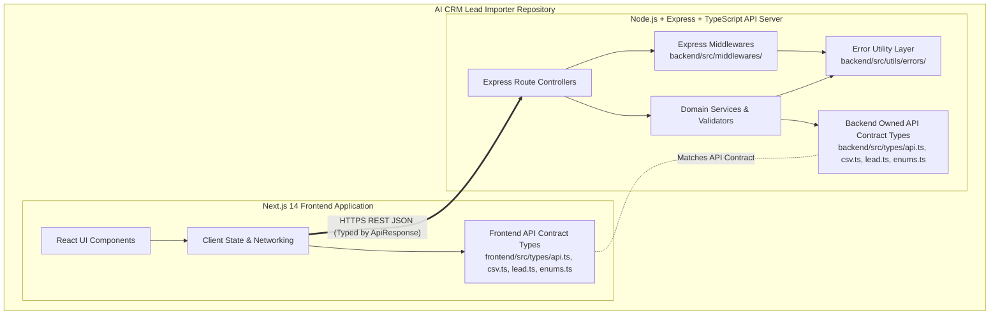

# Fullstack SPEC-0001: Project Foundation & Architecture

## Metadata

| Field | Value |
| :--- | :--- |
| **SPEC ID** | `SPEC-0001` |
| **Title** | Project Foundation & API Contract Layer |
| **Layer** | Fullstack / Architecture |
| **Status** | Implementation-Ready |
| **Authors** | Principal Software Architect |
| **Reviewers** | Senior Backend & Frontend Engineering Teams |
| **Dependencies** | None |

---

## Summary

This RFC defines the global architecture, repository structure, stateless request flow, API Contract Types (`types/`), enums, coding conventions, and configuration management for the **AI-Powered CRM CSV Importer (v2.0)**. The goal of `SPEC-0001` is to establish an unshakeable, type-safe contract between the frontend React (`Next.js`) client and the `Node.js/Express` backend service without introducing shared workspace complexity. The backend types define the API contract, while the frontend maintains matching interfaces for compile-time safety. All subsequent feature specifications (`SPEC-0002` through `SPEC-0009`) depend directly on the structural boundaries and contract definitions established in this document.

---

## Motivation

To keep the project simple and deployment-friendly for a 2-day engineering assignment, the frontend and backend maintain independent TypeScript type definitions while following the exact same API contract. This avoids monorepo tooling and shared package complexity while preserving clear boundaries between the two applications.

Ingesting arbitrary CSV files from diverse CRM systems (e.g., Salesforce, HubSpot, custom spreadsheets) and mapping them into a unified CRM schema requires strict boundary contracts. Duplicating a concise set of type interfaces between `frontend/src/types/` and `backend/src/types/` is considered the ideal trade-off for eliminating build and deployment complexity across independent cloud platforms (Vercel and Render/Railway).

### Architectural Decisions & Project-Wide Rules

#### 1. Stateless MVP
The MVP is completely stateless. There is no `ImportJob`, no Job entity, no Import History, no persistence, no database identifiers (`id`, `uuid`), and no storage identifiers. Those belong exclusively to `SPEC-0009` (Optional Persistence).
Every future SPEC describing the MVP must assume the strict request lifecycle:
```text
Request  ↓  Processing  ↓  Response
```
Nothing more.

#### 2. Backend Owns the API Contract
The backend defines the API contract inside `backend/src/types/`. The frontend maintains matching TypeScript interfaces inside `frontend/src/types/` for client-side type safety.

#### 3. API Contract Types
All directory layers defining inter-application data payloads are named `types` (`backend/src/types/`, `frontend/src/types/`). The backend types define the API contract, while the frontend maintains matching interfaces for compile-time safety.

#### 4. Forbidden Concepts in MVP (MVP vs. Stretch)
The following concepts are forbidden from MVP SPECs (`SPEC-0001` through `SPEC-0008`) unless clearly marked as Stretch or deferred to `SPEC-0009`:
`Database`, `PostgreSQL`, `AWS S3`, `ImportJob`, `Analytics`, `Import History`, `SSE`, `Reprocessing`, `Token Accounting`, `Estimated Cost`, `Docker`. Anything persistence-related belongs exclusively inside `SPEC-0009`.

### Goals

- Establish a simple two-application project structure (`frontend/` for Next.js and `backend/` for Express + TypeScript) that deploys independently without root workspace coupling.
- Maintain consistent, highly reliable API Contract Types (`LeadDTO`, `CSVRow`, `ApiResponse<T>`, `CRMStatusEnum`, `DataSourceEnum`), where the backend defines the API contract and the frontend maintains matching TypeScript interfaces for client-side type safety.
- Ensure independent frontend/backend builds that eliminate path mapping errors and compilation friction during CI/CD and cloud deployment.
- Standardize environment variable loading (runtime schema validation via runtime validation library, e.g. where an implementation may use `zod`) and error handling structures (`AppError` functional model in `backend/src/utils/errors/`) across both applications for maximum maintainability.

### Non-Goals

- Implementation of file upload mechanics, drag-and-drop UI, or CSV browser parsing (`Depends on SPEC-0002`).
- Implementation of HTTP API endpoints, batching splits, or OpenAI API communication (`Depends on SPEC-0003`, `SPEC-0004`, `SPEC-0006`).
- Definition of database connection pools, SQL migration scripts, or persistent job tracking (`Depends on SPEC-0009`).

---

## Guiding Principles

To ensure the project remains modern, maintainable, and engineering-friendly, all architectural and implementation decisions across `SPEC-0001` through `SPEC-0009` are governed by the following core principles:

- **Simplicity over abstraction**: Avoid unnecessary layers, wrappers, or enterprise design patterns when plain functions and clean data structures suffice.
- **Stateless by default**: The core ingestion and AI processing workflow operates entirely in-memory (`Request ↓ Processing ↓ Response`) without database identifiers or external infrastructure. Optional persistence is strictly decoupled into `SPEC-0009`.
- **Backend owns business rules**: The server is the authoritative source of truth for domain validation, normalization, and API contracts (`backend/src/types/`).
- **Frontend owns presentation**: The client manages UI state, interactive table rendering, and user experience, relying on matching local interfaces (`frontend/src/types/`) for compile-time safety.
- **Explicit interfaces over implicit behaviour**: Data structures (`LeadDTO`, `CSVRow`, `ApiResponse<T>`) and error envelopes (`AppError`) must be explicitly typed with `unknown` or exact properties rather than relying on `any` or hidden side effects.
- **Configuration over hardcoding**: Runtime behavior (API keys, model selection, batch sizes, retry limits, server ports) is controlled via environment variables validated at startup.
- **Functional programming over unnecessary classes**: Prefer plain objects, pure helper functions, and functional transformation pipelines over class hierarchies and complex inheritance structures.
- **Composition over inheritance**: Compose modular utility functions and middleware rather than extending base classes or inheriting domain entities.

---

## MVP Scope

- Two-application directory scaffold (`frontend/` and `backend/`).
- Local backend API Contract Types (`backend/src/types/api.ts`, `backend/src/types/csv.ts`, `backend/src/types/lead.ts`, `backend/src/types/enums.ts`).
- Matching local frontend API Contract Types (`frontend/src/types/api.ts`, `frontend/src/types/csv.ts`, `frontend/src/types/lead.ts`, `frontend/src/types/enums.ts`).
- Standardized API envelope response schemas (`ApiResponse<T>`, `ApiError`) and backend functional error handling model (`AppError` in `backend/src/utils/errors/`).
- Independent ESLint, Prettier, and TypeScript compiler configurations (`tsconfig.json`) inside `frontend/` and `backend/`.

## Stretch Scope

> Future enhancement:
> Automated API contract consistency verification.

---

## Technical Design

### Architecture

The system utilizes a decoupled, independent client-server architecture. The frontend (`Next.js`) handles high-bandwidth local CSV parsing (the MVP currently selects `PapaParse` as an implementation choice) and preview rendering, while the stateless backend (`Express + TypeScript`) orchestrates AI extraction, normalization, and validation. Both applications maintain their own local type definitions (`types/`) without symlinks, path aliases, or shared workspace tooling.



### API Changes

Not applicable (`SPEC-0001` establishes global API envelope schemas, but specific endpoints are owned by `SPEC-0003`).

#### Global API Envelope Schema
All HTTP API responses across the system must conform to the following generic TypeScript envelope interface (defined in `backend/src/types/api.ts` and matched in `frontend/src/types/api.ts`) to guarantee predictable client-side unwrapping and error handling. While `ApiResponse<T>` provides consistency across APIs, `ImportResponseDTO` must remain the primary payload for the import flow (`POST /api/import` returns `ApiResponse<ImportResponseDTO>`).

To ensure strict predictability and uniform consumer unwrapping across every endpoint, every HTTP API response must obey exact response semantics:

- **Successful response**:
  ```text
  success = true
  data present
  error omitted
  ```
- **Failed response**:
  ```text
  success = false
  error present
  data omitted
  ```

```typescript
export interface ApiResponse<T = void> {
  success: boolean;
  data?: T;
  error?: ApiError;
  meta?: {
    timestamp: string;
  };
}

export interface ApiError {
  code: string;
  message: string;
  details?: Record<string, unknown>;
  stack?: string; # Only included when NODE_ENV === 'development'
}
```

### Database Changes

Not applicable (`SPEC-0001` defines stateless in-memory domain payloads; physical relational tables and persistence identifiers are optional and governed exclusively by `SPEC-0009`).

### Infrastructure Changes

Not applicable (`SPEC-0008` owns hosting infrastructure for independent Vercel and Render/Railway deployments without Docker mandatory requirement for MVP).

### Error Handling (`backend/src/utils/errors/`)

Modern Express + TypeScript applications prefer pure functions and plain objects over class hierarchies. Every layer must use structured error objects rather than throwing raw strings or generic `Error` instances. `AppError` is a functional error model defined as a plain interface in `backend/src/utils/errors/app-error.ts`:

```typescript
export interface AppError {
  code: string;
  message: string;
  statusCode: number;
  details?: Record<string, unknown>;
}
```

To instantiate, normalize, and inspect error objects cleanly without class inheritance or `extends Error`, the error utility directory (`backend/src/utils/errors/`) provides lightweight helper functions (with zero subclasses or error hierarchies):

- `createAppError()` (`backend/src/utils/errors/create-app-error.ts`): Constructs a structured `AppError` plain object with explicit `code`, `message`, `statusCode`, and optional `details`.
- `normalizeError()` (`backend/src/utils/errors/normalize-error.ts`): Normalizes arbitrary caught exceptions (`unknown` errors, rejected Promises, validation failures) into a standard `AppError` payload.
- `isAppError()` (`backend/src/utils/errors/is-app-error.ts`): Type guard utility function checking whether an unknown object implements the `AppError` interface.

The error middleware in `backend/src/middlewares/` consumes these `AppError` objects directly to construct standardized `ApiResponse<T>` failed responses (`success = false, error present, data omitted`).

---

## Implementation Details

### Folder Structure

We adopt a clean, intentionally small two-application directory layout without workspace tooling, symlinks, or unnecessary subdirectories until they are actually needed.

```text
ai-crm-lead-importer/
├── frontend/                     # Next.js 14 Client Application (Deployed on Vercel)
│   ├── src/
│   │   ├── app/                  # Next.js App Router Pages
│   │   ├── components/           # UI Components (Upload, Table, Summary)
│   │   ├── services/             # API Client Wrappers & Networking
│   │   ├── types/                # Matching Frontend API Contract Types
│   │   │   ├── api.ts            # ApiResponse, AppError interface
│   │   │   ├── csv.ts            # CSVRow raw string map
│   │   │   ├── lead.ts           # LeadDTO, SkippedRecordDTO, ImportResponseDTO
│   │   │   └── enums.ts          # CRMStatusEnum, DataSourceEnum
│   │   └── hooks/                # Custom React Hooks
│   ├── package.json
│   └── tsconfig.json             # Standard Next.js TypeScript Configuration
├── backend/                      # Express + TypeScript API (Deployed on Render/Railway)
│   ├── src/
│   │   ├── controllers/          # Express Route Controllers (e.g., ImportController)
│   │   ├── middlewares/          # Express Middlewares (error, validation, future auth)
│   │   ├── services/             # Domain Orchestrators (e.g., ImportService)
│   │   ├── validators/           # Request & AI Schemas (an implementation may use `zod`)
│   │   ├── routes/               # Express Router Definitions
│   │   ├── types/                # Source of Truth Backend API Contract Types
│   │   │   ├── api.ts            # ApiResponse, AppError interface
│   │   │   ├── csv.ts            # CSVRow raw string map
│   │   │   ├── lead.ts           # LeadDTO, SkippedRecordDTO, ImportResponseDTO
│   │   │   └── enums.ts          # CRMStatusEnum, DataSourceEnum
│   │   └── utils/                # Utility modules
│   │       └── errors/           # Functional error model and helper functions
│   │           ├── app-error.ts         # AppError interface definition
│   │           ├── create-app-error.ts  # createAppError() helper
│   │           ├── normalize-error.ts   # normalizeError() helper
│   │           └── is-app-error.ts      # isAppError() type guard helper
│   ├── package.json
│   └── tsconfig.json             # Standard Node/Express TypeScript Configuration
└── README.md                     # Project Setup & Documentation
```

#### Middleware Directory (`backend/src/middlewares/`)
The `backend/src/middlewares/` directory owns cross-cutting request processing concerns cleanly separated from route controllers and domain services:
- **Error Middleware (`error.middleware.ts`)**: Consumes functional `AppError` objects and unhandled exceptions to return standardized `ApiResponse<T>` error payloads.
- **Request Validation Middleware (`validation.middleware.ts`)**: Intercepts incoming route requests to enforce server-side validation rules before invoking controllers.
- **Future Authentication Middleware**: Reserved for auth/session guard functions (`auth.middleware.ts`) if enterprise security or multi-tenant requirements (`SPEC-0009`) are introduced.

### Components

#### 1. Backend API Contract Types (`backend/src/types/`)
The backend defines the API contract.

##### `backend/src/types/enums.ts`
> Assumption: The allowed enums are strictly constrained by project-defined business rules. Any value outside this exact set must be rejected or nullified during post-AI validation (`SPEC-0005`).

```typescript
export enum CRMStatusEnum {
  GOOD_LEAD_FOLLOW_UP = 'GOOD_LEAD_FOLLOW_UP',
  DID_NOT_CONNECT = 'DID_NOT_CONNECT',
  BAD_LEAD = 'BAD_LEAD',
  SALE_DONE = 'SALE_DONE',
}

export enum DataSourceEnum {
  LEADS_ON_DEMAND = 'leads_on_demand',
  MERIDIAN_TOWER = 'meridian_tower',
  EDEN_PARK = 'eden_park',
  VARAH_SWAMY = 'varah_swamy',
  SARJAPUR_PLOTS = 'sarjapur_plots',
}
```

##### `backend/src/types/csv.ts`
`CSVRow` represents the raw input coming from client-side CSV parsing. Because it is a raw parser payload and not part of the CRM Lead domain, it lives inside its own dedicated file (`types/csv.ts`):

```typescript
/**
 * Raw row extracted from the CSV via client-side parsing.
 * - Every CSV cell is represented as a string.
 * - Empty cells are represented as "".
 * - Values are never null or undefined.
 * - This matches CSV parser (e.g., PapaParse) behaviour.
 */
export type CSVRow = Record<string, string>;
```

##### `backend/src/types/lead.ts`
> **Strict DTO Ownership Rule**: `LeadDTO`, `SkippedRecordDTO`, and `ImportResponseDTO` are strictly API transfer objects (`Data Transfer Objects`). They are NOT persistence entities. Future persistence entities introduced in `SPEC-0009` (`Lead`, `ImportJob`) must remain independent from API DTOs to ensure stateless API contracts are never coupled to database schema details (`Prisma`, `SQL`, or object storage identifiers).

`LeadDTO` represents a transient API response within the stateless MVP lifecycle. It is not a persisted entity; therefore, all database identifiers (`id`, `uuid`, generated identifiers) are strictly omitted.

```typescript
import { CRMStatusEnum, DataSourceEnum } from './enums';
import { CSVRow } from './csv';

/**
 * Standardized GrowEasy CRM Lead Record (Stateless Transient Payload).
 */
export interface LeadDTO {
  name: string | null;                     # Lead full name
  email: string | null;                    # First valid email found
  country_code: string | null;             # E.g., "+91" or "+1"
  mobile_without_country_code: string | null; # 10-digit primary mobile number
  company: string | null;                  # Organization or employer
  city: string | null;
  state: string | null;
  country: string | null;
  lead_owner: string | null;               # Assigned representative name or ID
  crm_status: CRMStatusEnum | null;        # Strict enum match
  crm_note: string;                        # Catch-all for remarks, overflow emails/mobiles
  data_source: DataSourceEnum | null;      # Strict enum match or null
  possession_time: string | null;          # Timeline string e.g. "Immediate", "6 months"
  description: string | null;              # General background or inquiry text
  created_at: string;                      # ISO 8601 string parseable by `new Date()`. If the source CSV does not contain a valid timestamp, the backend generates an ISO 8601 timestamp during normalization.
}

/**
 * Record skipped due to business rules (e.g. neither email nor mobile present).
 */
export interface SkippedRecordDTO {
  row_number: number;                      # 1-indexed original CSV row number
  reason: string;                          # Explanation (e.g. "Missing both primary email and mobile number")
  raw_row: CSVRow;                         # Original unparsed CSV key-value map
}

/**
 * Simplified stateless payload returned by POST /api/import to the frontend.
 */
export interface ImportResponseDTO {
  importedRecords: LeadDTO[];
  skippedRecords: SkippedRecordDTO[];
  summary: {
    totalRows: number;
    imported: number;
    skipped: number;
    processingTimeMs: number;
  };
}
```

#### 2. Frontend API Contract Types (`frontend/src/types/`)
The frontend maintains matching TypeScript interfaces inside `frontend/src/types/enums.ts`, `frontend/src/types/csv.ts`, `frontend/src/types/lead.ts`, and `frontend/src/types/api.ts` for client-side type safety. Because the types represent data transfer payloads over JSON REST APIs, maintaining exact matching interfaces guarantees 100% type safety without requiring complex build steps, symlinks, or code generation tools.

#### 3. Frontend Data-Fetching Strategy
Any data-fetching strategy may be used (fetch API, React Query, or equivalent). The project does not force React Query unless a specific UI feature genuinely benefits from its caching or mutation lifecycle.

### Dependencies

Both `frontend/` and `backend/` manage their own explicit dependencies in their local `package.json` files without any root workspace coupling:
- **Backend Dependencies (`backend/package.json`)**: HTTP framework (`express`), runtime validation library (where an implementation may use `zod`), environment management (`dotenv`), `cors`, `@types/express`, `typescript`.
- **Frontend Dependencies (`frontend/package.json`)**: UI framework (`next`, `react`, `react-dom`), CSV parsing library (where the MVP currently selects `papaparse`), icons/styling (`lucide-react`, `tailwindcss`), `typescript`.

### Configuration

#### Standard Backend TypeScript Configuration (`backend/tsconfig.json`)

```json
{
  "compilerOptions": {
    "target": "ES2022",
    "module": "NodeNext",
    "moduleResolution": "NodeNext",
    "strict": true,
    "esModuleInterop": true,
    "skipLibCheck": true,
    "forceConsistentCasingInFileNames": true,
    "outDir": "./dist",
    "rootDir": "./src"
  },
  "include": ["src/**/*"]
}
```

#### Standard Frontend TypeScript Configuration (`frontend/tsconfig.json`)

```json
{
  "compilerOptions": {
    "target": "ES5",
    "lib": ["dom", "dom.iterable", "esnext"],
    "allowJs": true,
    "skipLibCheck": true,
    "strict": true,
    "noEmit": true,
    "esModuleInterop": true,
    "module": "esnext",
    "moduleResolution": "bundler",
    "resolveJsonModule": true,
    "isolatedModules": true,
    "jsx": "preserve",
    "incremental": true,
    "plugins": [
      {
        "name": "next"
      }
    ],
    "paths": {
      "@/*": ["./src/*"]
    }
  },
  "include": ["next-env.d.ts", "**/*.ts", "**/*.tsx", ".next/types/**/*.ts"],
  "exclude": ["node_modules"]
}
```

### Canonical Environment Variables

These become the canonical environment variables for the entire project. No later SPEC may redefine these variables unless explicitly extending them.

#### Backend Environment Variables
| Variable Name | Required? | Default | Description |
| :--- | :--- | :--- | :--- |
| `OPENAI_API_KEY` | Yes | — | OpenAI API authentication secret key |
| `OPENAI_MODEL` | No | `'gpt-4.1-mini'` | Model identifier used for AI CSV extraction (`SPEC-0004`) |
| `AI_BATCH_SIZE` | No | `50` | Number of CSV rows processed per OpenAI batch request (`SPEC-0006`) |
| `MAX_BATCH_RETRIES`| No | `3` | Maximum exponential backoff retry attempts for failed AI batches (`SPEC-0006`) |
| `PORT` | No | `3001` | Express HTTP server listening port |
| `NODE_ENV` | No | `'development'`| Runtime environment mode (`development` \| `production` \| `test`) |

> Deployment-specific environment variables (CORS origins, deployment URLs, hosting configuration) are owned by SPEC-0008.

### Performance Considerations

- **Independent Frontend and Backend Builds**: Decoupling the applications allows Vercel (`next build`) and Render (`tsc`) to run isolated builds concurrently without waiting on cross-package resolution or workspace graph computation.
- **Simpler Deployment Pipeline**: Removing workspaces ensures zero build failures caused by unresolvable symlinks, missing root dependencies, or cloud platform build command mismatches.
- **Reduced Build Complexity & Easier Debugging**: When debugging type issues or API contract payloads, developers only inspect clean, self-contained local files inside `src/types/` without traversing complex workspace symlinks or `node_modules` module aliases.

### Scalability

If the project eventually grows beyond the 2-day assignment scope into multiple microservices or persistent storage systems, optional persistence entities (`Job`, `ImportJob`, database records) and stretch capabilities can be cleanly introduced via `SPEC-0009` without disrupting the core stateless MVP processing pipeline.

---

## Security Considerations

- **Strict Type Boundaries & Prototype Pollution Prevention**: By strictly enforcing `Record<string, string>` (`CSVRow`) and rejecting arbitrary prototype properties (`__proto__`, `constructor`), the domain types protect downstream parsers against Prototype Pollution attacks.
- **CSV MIME Type & File Extension Validation**: Client-side dropzone and backend validators strictly verify that uploaded files end with `.csv` and match valid CSV MIME types (`text/csv`, `application/vnd.ms-excel`), rejecting executables or scripts.
- **Server-Side Validation Rule**: The backend never trusts client-side validation. Every incoming request is validated again on the server before processing.
- **Operational Limits & Bounded Execution**: Upload validation, batching strategy, concurrency limits, retry behaviour, and operational limits are defined in their respective feature specifications (`SPEC-0002`, `SPEC-0003`, `SPEC-0006`). `SPEC-0001` defines architecture only.
- **Input Sanitization & Safe Handling of Uploaded Content**: All CSV cell values are treated as untrusted strings. Leading/trailing whitespace is trimmed, control characters are stripped, and output strings are escaped when generating exportable CSV files to prevent CSV injection (Formula Injection / DDE attacks when opened in Excel/CRM tools).
- **Prompt Injection Considerations**: User-supplied CSV headers and cell texts are isolated from instructions within deterministic JSON-mode prompts (`PromptBuilder`), ensuring untrusted CSV text cannot override system extraction rules.
- **Error Message Sanitization**: `ApiResponse<T>` and `AppError` explicitly suppress `stack` traces and internal filesystem paths when `NODE_ENV === 'production'`, preventing accidental disclosure of internal directory structures or memory layouts to end users.

---

## Testing Strategy

- **Independent Static Analysis**: Continuous integration runs `tsc --noEmit` inside `frontend/` and `backend/` independently to verify that both applications compile cleanly against their local type definitions (`types/`).
- **Type Verification**: Unit tests inside the backend verify that `AppError` correctly formats `ApiError` objects matching the exact `ApiResponse<T>` envelope specification matched by the frontend.

---

## Observability

> The MVP emits structured backend logs using a consistent format.

> Advanced observability (request correlation IDs, distributed tracing, metrics aggregation, external monitoring platforms) is intentionally deferred to future enhancements.

---

## Rollout Plan

1. Scaffold `frontend` application directory (`Next.js`).
2. Scaffold `backend` application directory (`Express + TypeScript`).
3. Create backend API Contract Types (`backend/src/types/api.ts`, `backend/src/types/csv.ts`, `backend/src/types/lead.ts`, `backend/src/types/enums.ts`) and functional error model helper directory (`backend/src/utils/errors/`).
4. Maintain matching API Contract Types in frontend (`frontend/src/types/api.ts`, `frontend/src/types/csv.ts`, `frontend/src/types/lead.ts`, `frontend/src/types/enums.ts`).
5. Implement stateless features across frontend and backend according to subsequent SPECs (`SPEC-0002` through `SPEC-0008`), saving persistence exclusively for `SPEC-0009`.

---

## Coding Conventions

To ensure uniform code style and intuitive navigation across the entire project, all implementations (`frontend/` and `backend/`) must strictly adhere to the following naming and formatting conventions:

| Entity Type | Convention | Example | Description |
| :--- | :--- | :--- | :--- |
| **Controllers** | `PascalCase` ending in `Controller` | `ImportController` | Express route handlers managing HTTP requests and responses (`controllers/import.controller.ts`). |
| **Services** | `PascalCase` ending in `Service` | `ImportService` | Domain orchestrators and business logic engines (`services/import.service.ts`). |
| **Validators** | `PascalCase` ending in `Validator` | `ImportValidator` | Runtime schema validators checking request inputs and AI outputs (runtime validation library where an implementation may use `zod` e.g. `validators/import.validator.ts`). |
| **Middlewares** | `kebab-case` ending in `.middleware.ts` | `error.middleware.ts`, `validation.middleware.ts` | Express middleware functions handling cross-cutting concerns (`middlewares/error.middleware.ts`). |
| **DTOs** | `PascalCase` ending in `DTO` | `LeadDTO`, `ImportResponseDTO` | Data transfer interfaces exchanged between layers and across the network (`types/lead.ts`). |
| **Enums** | `PascalCase` ending in `Enum` | `CRMStatusEnum`, `DataSourceEnum` | Strictly typed domain enumeration sets (`types/enums.ts`). |
| **Files** | `kebab-case` with dot-separated roles | `import.controller.ts`, `ai-client.ts` | All filenames must be lowercase and hyphen-separated, appended with `.controller.ts`, `.service.ts`, `.validator.ts`, `.middleware.ts`, or `.tsx`. |
| **Interfaces / Types** | `PascalCase` | `ApiResponse`, `AppError`, `LeadDTO`, `CSVRow` | TypeScript type and interface definitions (`types/`). |
| **Functions / Helpers** | `camelCase` | `createAppError`, `isAppError`, `normalizeError` | Pure functions, helper utilities, methods, and React hooks (`useDebounce`). |
| **Variables** | `camelCase` | `importedRecords`, `processingTimeMs` | Local variables and object properties. |
| **Constants** | `UPPER_SNAKE_CASE` | `DEFAULT_BATCH_SIZE`, `MAX_CONCURRENT_BATCHES` | Global or module-level immutable constants. |

---

## Alternatives Considered

### 1. Shared Package / Monorepo Workspace (`packages/shared`, `Turborepo`, `Nx`)
- **Decision**: Rejected.
- **Reason**: The project consists of only two independently deployed applications (`Next.js` on Vercel and `Express` on Render/Railway). Maintaining matching TypeScript type definitions (`~200–300 lines`) is significantly simpler than introducing workspace tooling, shared package builds, symlink management, and additional deployment complexity across separate hosting providers.

### 2. Server-Side CSV Parsing vs. Client-Side CSV Parsing
- **Decision**: Selected Client-Side CSV Parsing (where the MVP currently selects `PapaParse` as an implementation choice).
- **Reason**: Offloading high-bandwidth CSV parsing to the browser enables instant interactive table previews (`SPEC-0002`) and validation of file structure before any network transmission occurs. Sending structured JSON (`CSVRow[]`) to the backend (`SPEC-0003`) eliminates heavy stream-parsing overhead on the Express server, reducing CPU and memory footprint during concurrent batch execution.

---

## Questions and Concerns

- **Question**: Should `created_at` be represented as a TypeScript `Date` object or `string` in `LeadDTO`?
- **Decision**: Represented as `string` (ISO 8601 format e.g. `2026-07-10T12:00:00.000Z`). `Date` objects lose prototype methods across JSON over HTTP boundaries. Post-processing (`SPEC-0005`) guarantees that the string is parseable via `new Date(created_at)`. If the source CSV does not contain a valid timestamp, the backend generates an ISO 8601 timestamp during normalization.

---

## Architectural Rules for Future SPECs

To maintain total consistency across the entire engineering specification suite (`SPEC-0002` through `SPEC-0009`), all subsequent documents and future implementations MUST strictly obey the following architectural rules established in this foundation:

1. **Use `backend/src/types/` as the Source of Truth**: The backend defines the canonical API Contract Types (`types/api.ts`, `types/csv.ts`, `types/lead.ts`, `types/enums.ts`).
2. **Frontend Maintains Matching API Types**: The frontend mirrors the API Contract Types exactly inside `frontend/src/types/` without using `contracts/`, symlinks, or workspace tooling.
3. **Always Return `ApiResponse<T>`**: All backend HTTP endpoints must return the standardized `ApiResponse<T>` envelope (`ApiResponse<ImportResponseDTO>` for `POST /api/import`).
4. **Use `CSVRow`**: Always reference unparsed CSV row key-value maps using `CSVRow` (`Record<string, string>`). Never use `RawCSVRow`.
5. **Never Introduce `requestId` or `version` Metadata**: The `ApiResponse<T>` metadata envelope only contains `meta?: { timestamp: string }`. Do not introduce `requestId`, correlation IDs, or `version` headers until explicitly specified in future/stretch enhancements (`SPEC-0009`).
6. **Use Canonical Environment Variables**: Always reference the exact canonical variable list (`OPENAI_API_KEY`, `OPENAI_MODEL`, `AI_BATCH_SIZE`, `MAX_BATCH_RETRIES`, `PORT`, `NODE_ENV`). Do not invent or redefine environment variables across SPECs.
7. **Follow Coding Conventions**: Enforce standard naming conventions (`ImportController`, `ImportService`, `ImportValidator`, `LeadDTO`, `CRMStatusEnum`, `kebab-case` files, `camelCase` variables/functions, `UPPER_SNAKE_CASE` constants) uniformly across all specs and codebases.
8. **Do Not Introduce Persistence Concepts Before `SPEC-0009`**: Keep all MVP flows (`SPEC-0001` through `SPEC-0008`) 100% stateless (`Request ↓ Processing ↓ Response`). Never reference `ImportJob`, database entities, `id`/`uuid` fields in `LeadDTO`, `S3`, `PostgreSQL`, `Import History`, or `SSE` outside of `SPEC-0009`.
9. **SPEC-0001 Defines Architecture, Not Implementation Details**: Operational limits belong to feature-specific SPECs (`SPEC-0002`, `SPEC-0003`, `SPEC-0006`).
10. **Library Choices Are Implementation Details**: Unless they materially affect architecture, library choices (`PapaParse`, `zod`) must remain implementation-agnostic in foundational design.
11. **Avoid Using `any` in Public Interfaces**: Always use `unknown` or specific interfaces instead of `any` (`Record<string, unknown>`).
12. **Deployment-Specific Configuration Belongs Exclusively to SPEC-0008**: Hosting configurations, CORS origins, and deployment URLs are owned strictly by `SPEC-0008`.
13. **Reference Project Business Rules Rather Than Section Numbers**: Documentation must reference project-defined business rules rather than fragile section numbers that may become invalid if documents are reorganized.
14. **Prefer Functional Programming Over Class-Based Design**: Use plain objects, pure helper functions, and functional transformation pipelines rather than class hierarchies (`AppError`, custom class instances).
15. **Use Plain Objects and Helper Functions Instead of Inheritance Where Practical**: Avoid class inheritance (`extends Error`, domain entity inheritance); use compositional helper functions (`createAppError()`, `normalizeError()`, `isAppError()`) and plain TypeScript interfaces.
16. **API DTOs Are Independent of Persistence Models**: Data Transfer Objects (`LeadDTO`, `SkippedRecordDTO`, `ImportResponseDTO`) represent network contracts and are completely independent from future database models (`SPEC-0009`).
17. **`CSVRow` Belongs to `csv.ts`**: Because raw CSV row string maps (`Record<string, string>`) represent client-side parser output and not CRM domain records, `CSVRow` must reside in `types/csv.ts`.
18. **Every Request Must Be Validated Server-Side Regardless of Frontend Validation**: The backend never trusts client-side checks; every incoming HTTP request payload must be re-validated by server-side validation middleware (`validators/`, `middlewares/`).
19. **Middleware Owns Cross-Cutting Concerns**: Express middlewares (`backend/src/middlewares/`) own error handling (`error.middleware.ts`), request validation interception (`validation.middleware.ts`), and future authentication (`auth.middleware.ts`), keeping route controllers focused on request coordination.
20. **Architecture Documents Define Behaviour, Not Implementation Libraries**: Specifications describe desired architectural capabilities and behavior; specific libraries (`PapaParse`, `zod`) are implementation choices that may evolve without invalidating the architectural contract.

---

## References

- [TypeScript Strict Compiler Options](https://www.typescriptlang.org/docs/handbook/compiler-options.html)
- `Depends on:` None
