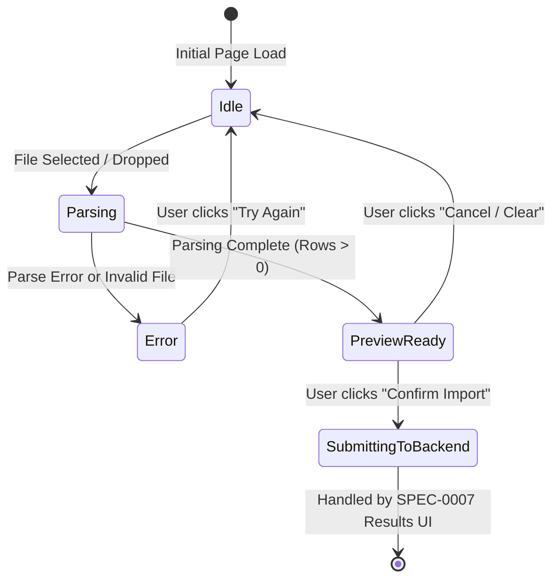

# Frontend SPEC-0002: CSV Upload & Client Preview

## Metadata

| Field | Value |
| :--- | :--- |
| **SPEC ID** | `SPEC-0002` |
| **Title** | CSV Upload & Client-Side Preview Component |
| **Layer** | Frontend |
| **Status** | Implementation-Ready |
| **Authors** | Principal Software Architect |
| **Reviewers** | Senior Frontend Engineering Team |
| **Dependencies** | Depends on `SPEC-0001` |

---

## Summary

This specification defines the frontend ingestion, client-side parsing, and data preview feature of the **AI-Powered CRM CSV Importer**. To strictly adhere to the business requirement that **no network calls or AI processing occur until user confirmation** (per project business rules), `SPEC-0002` implements a zero-server-latency workflow. The user selects or drags-and-drops a CSV file into the browser, where the `PapaParse` library parses the raw text directly within the browser's JavaScript engine. The parsed rows and columns are rendered into an interactive preview table with sticky headers and scrollable boundaries. Only upon clicking the "Confirm Import" button does the frontend emit the parsed `CSVRow[]` payload to downstream API layers (`SPEC-0003`).

---

## Motivation

Early iterations of CSV importers frequently trigger backend file uploads immediately upon file selection (e.g., uploading to S3 or creating database jobs before the user even inspects the data). This architecture introduces three critical failures:
1. **Unnecessary Network & AI Costs**: Users often select the wrong file or a malformed export. Sending unverified files to backend LLM parsers wastes API tokens and bandwidth.
2. **Poor User Experience**: Waiting for server roundtrips just to inspect CSV headers creates unnecessary friction and latency.
3. **Violation of Explicit Specification**: Project business rules explicitly mandate that no backend or AI processing happens before the user explicitly clicks the Confirm button.

### Goals

- Provide a polished Drag & Drop and File Picker dropzone with instant file type (`.csv`) and size validation.
- Execute 100% client-side CSV parsing using `PapaParse` inside a web worker or non-blocking main-thread task, handling varying delimiters (comma, semicolon, tab) automatically.
- Render a responsive, high-density preview table supporting horizontal and vertical scrolling with sticky column headers (`position: sticky`), capable of displaying at least the first 100 rows without UI freezing.
- Provide clear metrics: Total rows parsed, detected column headers, and filename.
- Gate all backend interactions behind an explicit, prominent "Confirm Import" button and a "Cancel / Clear" reset flow.

### Non-Goals

- Making HTTP requests (`POST /api/import`), S3 uploads, or backend API invocations (`Depends on SPEC-0003`).
- Invoking OpenAI or performing column-mapping heuristics on the client (`Depends on SPEC-0004`).
- Validating CRM business rules such as missing email/mobile skip logic (`Depends on SPEC-0005`).

---

## MVP Scope

- Drag-and-drop dropzone component (`<CsvDropzone />`) accepting `.csv` files.
- Client-side PapaParse integration returning `CSVRow[]` (`Record<string, string>[]`).
- Sticky-header data preview table (`<CsvPreviewTable />`) rendering up to 100 sample rows.
- File summary statistics card (filename, file size in KB, total row count, total column count).
- Action bar with "Confirm Import" button (which emits payload via callback) and "Cancel / Change File" button.
- Error handling for empty files, unparseable binary data, or malformed CSV syntax.

## Stretch Scope

- Web Worker integration for `PapaParse` to parse files $> 10\text{ MB}$ without blocking the UI main thread.
- Virtualized table rendering (`@tanstack/react-virtual`) allowing smooth client-side preview of $50,000+$ rows without DOM lag.
- Client-side header search/filtering within the preview modal.

---

## Technical Design

### Architecture

The upload and preview lifecycle operates entirely within memory inside the React component hierarchy using local state (`useState` / `useReducer`).

```mermaid
sequenceDiagram
    autonumber
    actor User
    participant DZ as CsvDropzone Component
    participant PP as PapaParse Engine (Client-Side)
    participant Preview as CsvPreviewTable Component
    participant Action as Action Bar (Confirm/Cancel)
    participant Orchestrator as Page PageController

    User->>DZ: Drag & drop CSV file (or select via input)
    DZ->>DZ: Validate file extension (.csv) & size limit (< 15MB)
    alt Invalid File (e.g. .xlsx, .pdf, >15MB)
        DZ-->>User: Display client-side error toast
    else Valid File
        DZ->>PP: Papa.parse(file, { header: true, skipEmptyLines: true })
        PP-->>DZ: Return { data: CSVRow[], meta: { fields, delimiter }, errors }
        DZ->>Orchestrator: onFileParsed(rawRows, fileMeta)
        Orchestrator->>Preview: Render table with sticky headers & sample rows
        Orchestrator->>Action: Enable "Confirm Import" button
    end
    
    User->>Preview: Scroll horizontally/vertically to verify headers & data
    User->>Action: Click "Confirm Import"
    Action->>Orchestrator: onConfirmImport(rawRows)
    Note over Orchestrator: Transition UI state to loading;<br/>emit rawRows to API Layer (SPEC-0003)
```

### Component State Machine



### API Changes

Not applicable (`SPEC-0002` makes zero network requests).

### Database Changes

Not applicable.

### Infrastructure Changes

Not applicable.

### Error Handling

| Error Scenario | Detection Mechanism | User-Facing Action |
| :--- | :--- | :--- |
| **Invalid File Type** | `file.type !== 'text/csv' && !file.name.endsWith('.csv')` | Show inline alert: *"Please upload a valid .csv file."* |
| **File Exceeds Size Limit** | `file.size > 15 * 1024 * 1024` (15 MB) | Show inline alert: *"File exceeds maximum allowed size of 15 MB."* |
| **Empty CSV File** | `Papa.parse` returns `data.length === 0` | Show inline alert: *"The uploaded CSV file contains no data rows."* |
| **Malformed CSV / Quote Mismatch** | `Papa.parse` returns non-empty `errors` array | Show warning badge: *"CSV formatting issues detected on X rows. Unparseable rows will be skipped."* |

---

## Implementation Details

### Folder Structure

```text
frontend/src/
├── components/
│   ├── upload/
│   │   ├── CsvDropzone.tsx           # Drag & drop and file picker interface
│   │   ├── CsvPreviewTable.tsx       # Sticky header table component
│   │   ├── FileSummaryCard.tsx       # Stats: row count, column count, size
│   │   └── UploadOrchestrator.tsx    # State container managing Idle -> Preview -> Confirm
│   └── ui/                           # Base Tailwind UI primitives (Button, Card, Alert)
└── types/
    └── upload.ts                     # Component props and parsing metadata types
```

### Components & TypeScript Interfaces

#### 1. Component Type Definitions (`frontend/src/types/upload.ts`)

```typescript
import { CSVRow } from './csv';

export interface CsvFileMetadata {
  filename: string;
  sizeBytes: number;
  totalRows: number;
  columns: string[];
  detectedDelimiter: string;
}

export interface CsvDropzoneProps {
  onFileParsed: (rows: CSVRow[], meta: CsvFileMetadata) => void;
  onError: (errorMessage: string) => void;
  isProcessing?: boolean;
}

export interface CsvPreviewTableProps {
  rows: CSVRow[];
  columns: string[];
  maxPreviewRows?: number; # Default 100 for UI performance
}

export interface UploadOrchestratorProps {
  onConfirm: (rows: CSVRow[], meta: CsvFileMetadata) => Promise<void>;
}
```

#### 2. Client-Side Parsing Logic (`CsvDropzone.tsx` snippet)

```typescript
import React, { useCallback } from 'react';
import Papa from 'papaparse';
import { CSVRow } from '../../types/csv';
import { CsvDropzoneProps, CsvFileMetadata } from '../../types/upload';

const MAX_FILE_SIZE_BYTES = 15 * 1024 * 1024; # 15 MB

export const CsvDropzone: React.FC<CsvDropzoneProps> = ({ onFileParsed, onError }) => {
  const processFile = useCallback((file: File) => {
    if (!file.name.toLowerCase().endsWith('.csv') && file.type !== 'text/csv') {
      onError('Invalid file format. Please upload a comma-separated values (.csv) file.');
      return;
    }

    if (file.size > MAX_FILE_SIZE_BYTES) {
      onError('File size exceeds the 15 MB limit. Please split the file.');
      return;
    }

    Papa.parse<CSVRow>(file, {
      header: true,
      skipEmptyLines: 'greedy',
      complete: (results) => {
        if (!results.data || results.data.length === 0) {
          onError('The selected CSV file appears to be empty or contains only headers.');
          return;
        }

        const columns = results.meta.fields || Object.keys(results.data[0] || {});
        const meta: CsvFileMetadata = {
          filename: file.name,
          sizeBytes: file.size,
          totalRows: results.data.length,
          columns,
          detectedDelimiter: results.meta.delimiter || ',',
        };

        onFileParsed(results.data, meta);
      },
      error: (error) => {
        onError(`Failed to parse CSV: ${error.message}`);
      },
    });
  }, [onFileParsed, onError]);

  # Render dropzone UI using Tailwind CSS...
};
```

#### 3. Sticky Header Preview Table Layout (`CsvPreviewTable.tsx` snippet)

To guarantee exact visual excellence without layout shifts or horizontal clipping, the table wrapper uses strict Tailwind layout tokens:

```tsx
import React from 'react';
import { CsvPreviewTableProps } from '../../types/upload';

export const CsvPreviewTable: React.FC<CsvPreviewTableProps> = ({
  rows,
  columns,
  maxPreviewRows = 100,
}) => {
  const displayRows = rows.slice(0, maxPreviewRows);

  return (
    <div className="w-full rounded-lg border border-slate-700 bg-slate-900 shadow-xl overflow-hidden">
      <div className="max-h-[480px] overflow-auto relative scrollbar-thin scrollbar-thumb-slate-700 scrollbar-track-slate-900">
        <table className="w-full text-left text-sm text-slate-300 border-collapse">
          <thead className="bg-slate-800 text-xs uppercase tracking-wider text-slate-400 sticky top-0 z-10 shadow-md">
            <tr>
              <th className="px-4 py-3 border-b border-slate-700 bg-slate-800 font-semibold sticky left-0 z-20 w-16 text-center">
                #
              </th>
              {columns.map((col) => (
                <th
                  key={col}
                  className="px-4 py-3 border-b border-slate-700 whitespace-nowrap font-semibold min-w-[140px]"
                >
                  {col}
                </th>
              ))}
            </tr>
          </thead>
          <tbody className="divide-y divide-slate-800">
            {displayRows.map((row, idx) => (
              <tr key={idx} className="hover:bg-slate-800/50 transition-colors">
                <td className="px-4 py-2 border-r border-slate-800 bg-slate-900/90 text-slate-500 text-xs font-mono sticky left-0 z-10 text-center">
                  {idx + 1}
                </td>
                {columns.map((col) => (
                  <td
                    key={`${idx}-${col}`}
                    className="px-4 py-2 whitespace-nowrap overflow-hidden text-ellipsis max-w-[240px]"
                    title={row[col] || ''}
                  >
                    {row[col] !== undefined && row[col] !== '' ? (
                      <span className="text-slate-200">{row[col]}</span>
                    ) : (
                      <span className="text-slate-600 italic">null</span>
                    )}
                  </td>
                ))}
              </tr>
            ))}
          </tbody>
        </table>
      </div>
      {rows.length > maxPreviewRows && (
        <div className="px-4 py-2 bg-slate-800/60 border-t border-slate-700 text-xs text-slate-400 text-center">
          Showing preview of first <strong className="text-slate-200">{maxPreviewRows}</strong> rows out of <strong className="text-slate-200">{rows.length.toLocaleString()}</strong> total rows. All rows will be processed upon confirmation.
        </div>
      )}
    </div>
  );
};
```

### Dependencies

- `papaparse` (^5.4.1) & `@types/papaparse` (^5.3.14) — Industry standard, high-performance CSV/TSV parser for JavaScript.
- `lucide-react` (^0.350.0) — Icons for upload dropzone (`UploadCloud`, `FileSpreadsheet`, `AlertCircle`).

### Configuration

No external server configuration required. Client-side parsing constants (`MAX_FILE_SIZE_BYTES = 15MB`, `MAX_PREVIEW_ROWS = 100`) are centralized in `frontend/src/types/upload.ts`.

### Environment Variables

Not applicable (`SPEC-0002` operates purely client-side).

### Performance Considerations

- **Memory Limit Safety**: When `PapaParse` reads a $15\text{ MB}$ CSV file into memory as `Record<string, string>[]`, heap utilization peaks around $60\text{ MB} - 80\text{ MB}$. Modern desktop and mobile browsers handle this comfortably without garbage collection pauses.
- **Preview Rendering Bottleneck**: Rendering $5,000+$ table rows in React DOM simultaneously causes severe layout reflow lag. We strictly slice `displayRows = rows.slice(0, 100)` for the preview viewport while keeping the full `rows` array in React state ready for API submission.

### Scalability

If future requirements mandate client-side ingestion of $100\text{ MB}+$ CSV files ($>100,000$ leads), the `PapaParse` invocation in `CsvDropzone.tsx` can be migrated from main-thread execution to a Web Worker (`worker: true` option in PapaParse) without changing the `onFileParsed` callback contract or the `CsvPreviewTable` component structure.

---

## Security Considerations

- **Cross-Site Scripting (XSS) Prevention**: CSV files frequently contain malicious cell values such as `<script>alert(1)</script>` or spreadsheet formula injection (`=cmd|' /C calc'!A0`). Because `CsvPreviewTable` renders cell values via React JSX expressions (`<span>{row[col]}</span>`) rather than `dangerouslySetInnerHTML`, all HTML entities are automatically escaped by React.
- **Client-Side Denial of Service (DoS)**: Maliciously crafted CSV files with millions of columns or deeply nested quote escapes could freeze the browser tab. The strict $15\text{ MB}$ file size limit and PapaParse's built-in step limit guard against client-side thread lockups.

---

## Testing Strategy

### Unit & Component Tests (`Vitest` + `React Testing Library`)
- **Dropzone Validation**: Assert that dropping a `.png` or `.pdf` file immediately invokes `onError` with a file type warning and does not call `Papa.parse`.
- **Parsing Verification**: Mock PapaParse to return 5 raw lead rows with custom headers (`["Full Name", "E-mail Address", "Cell Phone"]`). Verify `onFileParsed` receives exactly the array and correct `CsvFileMetadata`.
- **Sticky Table Rendering**: Assert that `CsvPreviewTable` renders exactly 100 `<tr>` elements when passed an array of 500 rows, and renders the warning banner indicating truncation.
- **Confirm Gating**: Assert that the "Confirm Import" button is disabled during initial load/parsing, and enabled *only* after `onFileParsed` successfully populates state. Assert that clicking "Confirm Import" triggers `onConfirm(rawRows)` exactly once without executing any `fetch()` or `axios` calls directly inside the upload components.

---

## Observability

- **Client-Side Analytics Hooks**: When `onFileParsed` triggers successfully, the frontend emits a structured browser telemetry event:
  ```json
  {
    "event": "csv_upload_preview_loaded",
    "filename": "q3_leads_export.csv",
    "row_count": 4250,
    "column_count": 14,
    "parse_duration_ms": 112
  }
  ```
- **Error Logging**: Client-side parse failures trigger a `csv_upload_parse_error` event containing the PapaParse error code and row index.

---

## Rollout Plan

1. Install `papaparse` and `@types/papaparse` in `frontend/`.
2. Implement `<CsvDropzone />`, `<FileSummaryCard />`, and `<CsvPreviewTable />` components.
3. Assemble components inside `<UploadOrchestrator />` on the main `/import` page.
4. Verify via network tab inspection that dropping a file and viewing the preview table generates **zero HTTP requests**.

---

## Alternatives Considered

### 1. Server-Side CSV Parsing via Multipart Form Upload
- **Description**: User uploads CSV via `<input type="file" />`; browser immediately `POST`s the file to Express, where `multer` + `csv-parser` parse the file on the backend and return JSON preview rows.
- **Justification for Rejection**: This directly violates the assignment's core workflow rule: *"No network call yet... Preview table renders... No AI processing occurs at this stage. User clicks Confirm -> only now does the frontend call the backend API"* (per project business rules). Additionally, server-side parsing consumes server bandwidth and memory for files the user might ultimately cancel or discard after previewing.

### 2. SheetJS (`xlsx`) Library vs. PapaParse
- **Justification for Rejection**: `xlsx` supports Excel (`.xls`, `.xlsx`) alongside CSV, but its bundle size ($> 400\text{ KB}$ minified) is significantly larger than PapaParse ($\sim 20\text{ KB}$). Since the project specification explicitly targets CSV files (`CSV Import System`), PapaParse provides superior performance, streaming capabilities, and a smaller client bundle footprint.

---

## Questions and Concerns

- **Question**: What should happen if the uploaded CSV contains duplicate column headers (e.g. two columns named `Email`)?
- **Decision**: PapaParse handles duplicate headers by appending numeric suffixes (`Email`, `Email_1`) when `header: true` is enabled. The `CsvPreviewTable` will display both columns distinctively. The downstream AI mapping (`SPEC-0004`) will receive both headers and intelligently merge or select the primary email field based on cell contents.

---

## References

- [PapaParse Official Documentation](https://www.papaparse.com/docs)
- [RFC 4180 CSV Standard Specification](https://www.rfc-editor.org/rfc/rfc4180)
- `Depends on SPEC-0001` (Shared DTOs `CSVRow`)
