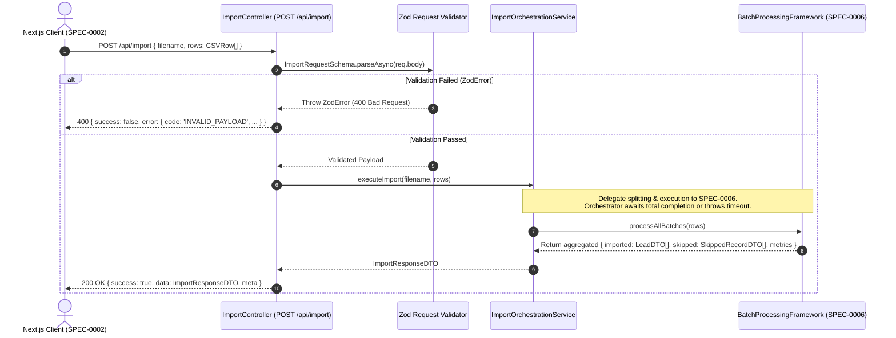

# Backend SPEC-0003: Import API

## Metadata

| Field | Value |
| :--- | :--- |
| **SPEC ID** | `SPEC-0003` |
| **Title** | Import API Request Controller & Orchestration Service |
| **Layer** | Backend |
| **Status** | Implementation-Ready |
| **Authors** | Principal Software Architect |
| **Reviewers** | Senior Backend Engineering Team |
| **Dependencies** | Depends on `SPEC-0002` (and `SPEC-0001`) |

---

## Summary

This specification defines the primary backend HTTP endpoint, `POST /api/import`, responsible for receiving parsed CSV data from the client (`SPEC-0002`), validating the request payload structure, and orchestrating the downstream batch processing (`SPEC-0006`), AI extraction (`SPEC-0004`), and validation (`SPEC-0005`) pipeline. The controller enforces strict input validation using `Zod`, ensures robust HTTP error handling, aggregates partial results from worker batches, and returns a unified, typed JSON response (`ImportResponseDTO`) to the frontend.

---

## Motivation

Ingesting raw tabular data over HTTP requires strict boundary enforcement. If an endpoint accepts malformed arrays, non-string JSON primitives, or excessively large payloads without validation, downstream services will fail unpredictably or run out of memory. 

### Goals

- Implement `POST /api/import` in Express + TypeScript, accepting JSON payloads containing `filename` and an array of `CSVRow` (`Record<string, string>[]`).
- Enforce request validation via `Zod` before passing data to internal processing layers.
- Orchestrate the lifecycle of an import request: validating input $\rightarrow$ delegating array splitting/processing to `BatchProcessor` (`Depends on SPEC-0006`) $\rightarrow$ aggregating successful (`LeadDTO[]`) and skipped (`SkippedRecordDTO[]`) records $\rightarrow$ returning the structured `ApiResponse<ImportResponseDTO>`.
- Provide precise HTTP status codes and structured error bodies for payload violations, timeouts, and internal failures.

### Non-Goals

- Implementing batch splitting algorithms, concurrency limits, rate-limit backoff, or retry loops (`Depends on SPEC-0006`).
- Building the system prompt, managing token counts, or communicating directly with OpenAI (`Depends on SPEC-0004`).
- Executing domain validation rules (e.g. enum checks or email/mobile skip requirements) (`Depends on SPEC-0005`).
- Persisting import jobs or extracted leads to PostgreSQL or AWS S3 (`Depends on SPEC-0009`).

---

## MVP Scope

- Express route definition for `POST /api/import`.
- `Zod` request body validation schema (`ImportRequestSchema`) enforcing maximum array bounds ($5,000$ rows max per request for stateless MVP).
- Controller handler orchestrating the execution flow (`ImportOrchestrationService`).
- Aggregation of batch results into `ImportResponseDTO`.
- Error middleware mapping `AppError` and Zod validation errors to standardized HTTP JSON responses.

## Stretch Scope

- Streaming progress updates via Server-Sent Events (`GET /api/import/progress/:jobId`) (`Depends on SPEC-0009`).
- Asynchronous webhook callback execution for imports exceeding 10,000 rows.

---

## Technical Design

### Architecture

The `POST /api/import` endpoint acts as the single entry point for CSV data processing. It decouples HTTP protocol concerns from background processing logic.



### API Changes

#### `POST /api/import`

##### Request Headers
- `Content-Type: application/json`
- `X-Request-ID: string` (Optional correlation UUID; generated if missing)

##### Request Body Schema (`ImportRequestDTO`)
```json
{
  "filename": "q3_meridian_leads.csv",
  "rows": [
    {
      "Full Name": "Aarav Sharma",
      "Email Address": "aarav@example.com",
      "Phone Number": "9876543210",
      "Project Interest": "Meridian Tower"
    },
    {
      "Full Name": "Priya Patel",
      "Email Address": "",
      "Phone Number": "",
      "Project Interest": "Eden Park"
    }
  ]
}
```

##### Successful Response Body (`200 OK`)
```json
{
  "success": true,
  "data": {
    "importedRecords": [
      {
        "name": "Aarav Sharma",
        "email": "aarav@example.com",
        "country_code": "+91",
        "mobile_without_country_code": "9876543210",
        "company": null,
        "city": null,
        "state": null,
        "country": "India",
        "lead_owner": null,
        "crm_status": "GOOD_LEAD_FOLLOW_UP",
        "crm_note": "Interested in Meridian Tower",
        "data_source": "meridian_tower",
        "possession_time": null,
        "description": "Project Interest: Meridian Tower",
        "created_at": "2026-07-10T14:20:00.000Z"
      }
    ],
    "skippedRecords": [
      {
        "row_number": 2,
        "reason": "Missing both primary email and mobile number",
        "raw_row": {
          "Full Name": "Priya Patel",
          "Email Address": "",
          "Phone Number": "",
          "Project Interest": "Eden Park"
        }
      }
    ],
    "summary": {
      "totalRows": 2,
      "imported": 1,
      "skipped": 1,
      "processingTimeMs": 1420
    }
  },
  "meta": {
    "timestamp": "2026-07-10T14:20:01.420Z"
  }
}
```

### Database Changes

Not applicable (`SPEC-0003` is strictly stateless and in-memory).

### Infrastructure Changes

Not applicable (`SPEC-0008` manages deployment).

### Error Handling

| HTTP Status | Error Code | Trigger Condition |
| :--- | :--- | :--- |
| `400 Bad Request` | `INVALID_PAYLOAD` | Request body missing `filename` or `rows`, `rows` is not an array, or `rows.length === 0`. |
| `413 Payload Too Large` | `PAYLOAD_EXCEEDS_LIMIT` | `rows.length > 5000` or JSON body exceeds Express body parser limit ($25\text{ MB}$). |
| `502 Bad Gateway` | `AI_SERVICE_UNAVAILABLE` | Downstream batch orchestrator (`SPEC-0006`) reports exhaustion of all retry attempts against OpenAI. |
| `504 Gateway Timeout` | `IMPORT_TIMEOUT` | Processing duration exceeds the stateless HTTP execution limit ($55\text{ seconds}$). |

---

## Implementation Details

### Folder Structure

```text
backend/src/
├── controllers/
│   └── import.controller.ts          # Express route handler for POST /api/import
├── routes/
│   └── import.routes.ts              # Route declarations and validator binding
├── services/
│   └── importOrchestrator.service.ts # Service linking API request to Batch Framework
└── validators/
    └── import.validator.ts           # Zod schemas for POST /api/import
```

### Components & TypeScript Interfaces

#### 1. Zod Request Schema (`backend/src/validators/import.validator.ts`)

```typescript
import { z } from 'zod';

export const ImportRequestSchema = z.object({
  filename: z.string().min(1, 'Filename is required').max(255, 'Filename exceeds 255 characters'),
  rows: z
    .array(z.record(z.string(), z.string()))
    .min(1, 'At least one data row must be provided')
    .max(5000, 'Stateless import allows a maximum of 5,000 rows per request'),
});

export type ImportRequestDTO = z.infer<typeof ImportRequestSchema>;
```

#### 2. Import Controller (`backend/src/controllers/import.controller.ts`)

```typescript
import { Request, Response, NextFunction } from 'express';
import { ImportRequestSchema } from '../validators/import.validator';
import { ImportService } from '../services/import.service';
import { ApiResponse } from '../types/api';
import { createAppError } from '../utils/errors/create-app-error';

export class ImportController {
  private importService: ImportService;

  constructor(importService = new ImportService()) {
    this.importService = importService;
  }

  public handleImport = async (req: Request, res: Response, next: NextFunction): Promise<void> => {
    try {
      # 1. Strict Payload Validation
      const parseResult = await ImportRequestSchema.safeParseAsync(req.body);
      if (!parseResult.success) {
        throw createAppError(
          'Invalid import payload structure',
          'INVALID_PAYLOAD',
          400,
          { zodErrors: parseResult.error.flatten() }
        );
      }

      const { rows } = parseResult.data;

      # 2. Execute Stateless Processing (Delegates batching to SPEC-0006)
      const importResponse = await this.importService.executeImport(rows);

      # 3. Construct Standardized Envelope Response
      const responseBody: ApiResponse<ImportResponseDTO> = {
        success: true,
        data: importResponse,
        meta: {
          timestamp: new Date().toISOString(),
        },
      };

      res.status(200).json(responseBody);
    } catch (error) {
      next(error); # Forward to global error middleware
    }
  };
}
```

#### 3. Stateless Import Service (`backend/src/services/import.service.ts`)

```typescript
import { ImportResponseDTO } from '../types/lead';
import { CSVRow } from '../types/csv';
# Depends on SPEC-0006: BatchProcessor
import { BatchProcessor } from './batchProcessor.service';

export class ImportService {
  private batchProcessor: BatchProcessor;

  constructor(batchProcessor = new BatchProcessor()) {
    this.batchProcessor = batchProcessor;
  }

  public async executeImport(rows: CSVRow[]): Promise<ImportResponseDTO> {
    const startTime = Date.now();

    # Delegate array splitting, concurrent execution, and retries to SPEC-0006
    # BatchProcessor internally invokes AI Extraction (SPEC-0004) and Validation (SPEC-0005)
    const batchResults = await this.batchProcessor.processAllBatches(rows);

    const processingTimeMs = Date.now() - startTime;

    return {
      importedRecords: batchResults.imported,
      skippedRecords: batchResults.skipped,
      summary: {
        totalRows: rows.length,
        imported: batchResults.imported.length,
        skipped: batchResults.skipped.length,
        processingTimeMs,
      },
    };
  }
}
```

### Dependencies

- `express` (^4.19.2) & `@types/express` (^4.17.21) — HTTP server framework.
- `zod` (^3.22.0) — Runtime request body validation.
- `uuid` (^9.0.0) — Job ID generation.

### Configuration

Express body parser (`app.use(express.json({ limit: '25mb' }))`) must be configured to permit JSON payloads up to $25\text{ MB}$ to accommodate 5,000 dense rows.

### Environment Variables

| Variable Name | Layer | Type | Default | Description |
| :--- | :--- | :--- | :--- | :--- |
| `HTTP_REQUEST_TIMEOUT_MS` | Backend | `number` | `55000` | Maximum time allowed before Express closes connection with 504. |

### Performance Considerations

- **V8 Garbage Collection**: Parsing large JSON payloads inside Express blocks the event loop momentarily. By enforcing a hard ceiling of 5,000 rows per request in `ImportRequestSchema`, we ensure JSON payload size stays well below $10\text{ MB}$, keeping event loop blocking below $15\text{ ms}$.

### Scalability

If future requirements demand importing $100,000+$ rows synchronously, `SPEC-0003` will extend `executeImport` to offload row arrays directly to PostgreSQL (`SPEC-0009`) and return a `202 Accepted` response with a `job_id` immediately, allowing the client to poll or receive SSE updates without altering the core controller interface.

---

## Security Considerations

- **JSON Denial of Service (DoS)**: Malicious clients sending $500\text{ MB}$ JSON payloads could crash the Express server. The strict $25\text{ MB}$ `express.json` limit combined with Zod's `max(5000)` row constraint protects against memory exhaustion.
- **Header Sanitization**: All incoming `Record<string, string>` keys are validated to ensure they do not overwrite internal Object prototype properties (`__proto__`, `constructor`).

---

## Testing Strategy

### Integration & Unit Tests (`Supertest` + `Vitest`)
- **Payload Validation Rejection**: `POST /api/import` with `rows: []` or missing `filename`. Assert HTTP `400 Bad Request` and `INVALID_PAYLOAD` error code.
- **Max Row Limit Rejection**: Send payload containing 5,001 items in `rows`. Assert HTTP `413 Payload Too Large` or Zod validation error.
- **Orchestrator Delegation**: Mock `BatchProcessingFramework.processAllBatches` (`Depends on SPEC-0006`) to return 3 imported records and 1 skipped record. Assert that `ImportController` returns HTTP `200 OK` with `total_imported: 3` and `total_skipped: 1` matching exact DTO specifications.

---

## Observability

- **Structured Access & Audit Logging**: Every incoming `POST /api/import` request generates two structured log lines:
  - `INFO`: `import_request_received` (`jobId`, `filename`, `totalRows`, `clientIp`)
  - `INFO/ERROR`: `import_request_completed` (`jobId`, `status`, `durationMs`, `importedCount`, `skippedCount`)

---

## Rollout Plan

1. Create `import.validator.ts` and verify Zod schemas against sample payloads.
2. Create `importOrchestrator.service.ts` with mock boundaries for `BatchProcessingFramework`.
3. Create `import.controller.ts` and bind to Express router `import.routes.ts` (`POST /api/import`).
4. Execute `Supertest` API contract verification tests.

---

## Alternatives Considered

### 1. Multipart Form Upload Directly to Backend API (`POST /api/import` with `req.file`)
- **Justification for Rejection**: This shifts CSV parsing (`PapaParse`) from the client to the server (`csv-parser`). As documented in `SPEC-0002`, server-side parsing violates project-defined business rules ("client-side parse & preview... Confirm button gating the API call"). Accepting pre-parsed `CSVRow[]` JSON guarantees the backend receives cleanly formatted, pre-confirmed data.

### 2. GraphQL vs. REST POST Endpoint
- **Justification for Rejection**: GraphQL adds heavy schema resolution overhead and complex error handling (`200 OK` with internal `errors` array). A REST `POST` endpoint typed strictly with `ApiResponse<T>` is simpler, faster to implement, and directly compatible with standard HTTP webhook triggers.

---

## Questions and Concerns

- **Question**: What happens if the Express request times out ($>55\text{ s}$) due to OpenAI API degradation while halfway through batch execution?
- **Decision**: The HTTP connection will terminate with `504 Gateway Timeout`. Because MVP (`SPEC-0003`) is stateless, the client must retry the entire import job. For persistent stretch implementations (`SPEC-0009`), background workers continue processing even if the HTTP connection drops.

---

## References

- [Express API Error Handling Best Practices](https://expressjs.com/en/guide/error-handling.html)
- [Zod Object & Array Validation](https://zod.dev/)
- `Depends on SPEC-0002` (`CSVRow[]` client payload)
- `Depends on SPEC-0006` (`BatchProcessingFramework` service execution)
