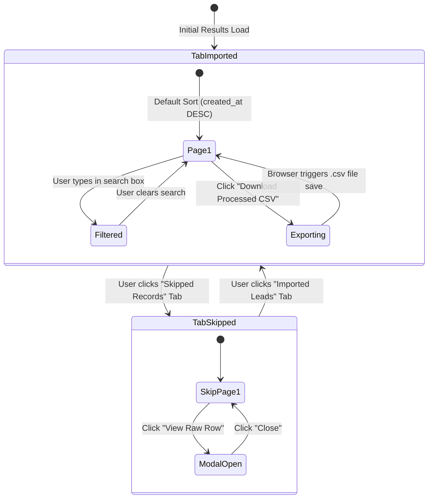

# Frontend SPEC-0007: Import Results UI & Processed Export

## Metadata

| Field | Value |
| :--- | :--- |
| **SPEC ID** | `SPEC-0007` |
| **Title** | Import Results UI, Interactive Table Views & RFC 4180 CSV Export Service |
| **Layer** | Frontend |
| **Status** | Implementation-Ready |
| **Authors** | Principal Software Architect |
| **Reviewers** | Senior Frontend Engineering & UX Teams |
| **Dependencies** | Depends on `SPEC-0005` (and `SPEC-0003`, `SPEC-0001`) |

---

## Summary

This specification defines the post-import interactive presentation and export layer (`<ImportResultsDashboard />`). Once `POST /api/import` (`SPEC-0003`) returns the unified `ImportResponseDTO` containing validated records (`Depends on SPEC-0005`), the frontend transitions to a high-density dashboard. `SPEC-0007` implements summary KPI cards, tabbed views (`Successfully Imported` vs. `Skipped Records`), multi-column sorting, client-side pagination, real-time keyword filtering, and a client-side CSV generator ("Download Processed CSV"). To guarantee full compliance with project-defined business rules, the CSV export engine enforces strict RFC 4180 escaping rules—properly enclosing fields in double quotes, escaping quotes as `""`, and ensuring `crm_note` or `description` line breaks are escaped (`\n`) so exported CSV files open cleanly in Excel or third-party CRM tools without corrupted row counts.

---

## Motivation

Once AI transformation completes, users must verify which leads were imported and precisely why certain rows were skipped (`Missing both primary email and mobile number`). Without clear search, pagination, and reason tooltips, auditing a 2,000-row import job is overwhelming. Furthermore, if the "Download Processed CSV" feature concatenates raw strings without RFC 4180 escaping, multi-line remarks inside `crm_note` (`"Called user on Tuesday.\nNeeds follow up."`) will split into two separate rows in Excel, destroying the integrity of the data export.

### Goals

- Render a summary KPI header displaying `total_rows_received`, `total_imported`, `total_skipped`, and execution telemetry (`duration_ms`, `total_tokens_used`, `estimated_cost_usd`).
- Provide tabbed table views:
  - **Imported Table (`LeadDTO[]`)**: Interactive columns with sortable headers, search filtering across `name/email/mobile/company/crm_note`, and pagination (25/50/100 items/page).
  - **Skipped Table (`SkippedRecordDTO[]`)**: Highlighting 1-indexed `row_number`, exact `reason` badge, and an expandable modal/drawer (`<RawRowModal />`) displaying the original unmapped JSON `raw_row`.
- Implement client-side search across all loaded records using debounced input (`useDebounce` hook).
- Implement an RFC 4180-compliant CSV Export Generator (`downloadCsvExport`) enabling one-click download of imported leads or skipped records.

### Non-Goals

- Executing API calls to `POST /api/import` (`Depends on SPEC-0003`).
- Validating CRM schema rules or normalizing phone numbers (`Depends on SPEC-0005`).
- Persisting export logs or re-triggering failed batches via backend endpoints (`Depends on SPEC-0009`).

---

## MVP Scope

- Summary KPI metric cards component (`<SummaryCards />`).
- Tabbed navigation container (`<ResultsTabs />` switching between `Imported (${total_imported})` and `Skipped (${total_skipped})`).
- `<ImportedLeadsTable />` with sorting (`useSortableData`), search (`<SearchBar />`), and pagination (`<PaginationControls />`).
- `<SkippedRecordsTable />` with reason display and `<RawRowViewer />` slide-over modal.
- Client-side RFC 4180 CSV Export utility (`exportToCsv`).

## Stretch Scope

- Virtualized infinite-scroll results table (`@tanstack/react-table` + `@tanstack/react-virtual`) handling $50,000+$ records at $60\text{ fps}$.
- Batch edit UI: allowing users to manually fill missing emails on skipped records and re-submit just those specific rows to `POST /api/import`.

---

## Technical Design

### Architecture

```mermaid
graph TD
    subgraph State Store from SPEC-0003 Response
        Response[ImportResponseDTO<br/>imported: LeadDTO[]<br/>skipped: SkippedRecordDTO[]<br/>totals & metrics]
    end

    subgraph Results UI Dashboard - SPEC-0007
        KPI[Summary KPI Cards<br/>Total, Imported, Skipped, Duration & Cost]
        Tabs[Tab Switcher: Imported vs. Skipped]
        Search[Debounced Search Filter<br/>Queries across name, email, note, reason]
        
        subgraph Imported View
            TableImp[ImportedLeadsTable Component<br/>Pagination: 25/50/100 | Multi-column Sort]
            ExportImp[Button: Download Processed CSV]
        end
        
        subgraph Skipped View
            TableSkip[SkippedRecordsTable Component<br/>Displays row_number & reason]
            Modal[RawRowViewer Modal<br/>Inspect unparsed JSON]
            ExportSkip[Button: Download Skipped CSV]
        end
        
        RFC4180[RFC 4180 CSV Exporter Service<br/>Escapes quotes & literal \n line breaks]
    end

    Response --> KPI
    Response --> Tabs
    Tabs --> TableImp & TableSkip
    Search --> TableImp & TableSkip
    TableSkip --> Modal
    ExportImp -->|LeadDTO[]| RFC4180
    ExportSkip -->|SkippedRecordDTO[]| RFC4180
    RFC4180 -->|Blob download| UserBrowser[User File System (.csv)]
```

### Component State Machine



### API Changes

Not applicable (`SPEC-0007` operates entirely client-side on the memory payload returned by `SPEC-0003`).

### Database Changes

Not applicable.

### Infrastructure Changes

Not applicable.

### Error Handling

| Error Scenario | Detection Mechanism | User-Facing Action |
| :--- | :--- | :--- |
| **Empty Results Array** | `imported.length === 0 && skipped.length === 0` | Display `<EmptyResultsState />`: *"No records were returned from the import job."* |
| **Export Memory Exceeded** | `exportToCsv` throws allocation error (`RangeError`) on extreme datasets | Catch error and display toast: *"Export dataset too large for single browser download. Please use backend export."* (`SPEC-0009`). |
| **Corrupted Raw Row JSON** | `JSON.stringify(raw_row)` throws inside modal | Display fallback text: *"Raw row data could not be serialized."* |

---

## Implementation Details

### Folder Structure

```text
frontend/src/
├── components/
│   └── results/
│       ├── ImportResultsDashboard.tsx  # Main container linking tabs, search, and exports
│       ├── SummaryCards.tsx            # KPI metrics display
│       ├── ImportedLeadsTable.tsx      # Sortable and paginated LeadDTO table
│       ├── SkippedRecordsTable.tsx     # Skipped records table with exact reason column
│       ├── RawRowModal.tsx             # Slide-over modal displaying original unparsed row
│       └── PaginationControls.tsx      # Next/Prev/Page Size selector
├── hooks/
│   ├── useDebounce.ts                  # Debounce input for high-performance search
│   └── useTableSort.ts                 # Column sorting state and memoized comparator
└── utils/
    └── csvExporter.ts                  # RFC 4180 compliant CSV serialization and download
```

### Components & TypeScript Interfaces

#### 1. RFC 4180 CSV Exporter (`frontend/src/utils/csvExporter.ts`)
> Assumption: To satisfy project-defined business rules (`CSV-safety of AI output... must remain expressible as a single CSV row — no unintended line breaks`), the exporter strictly implements RFC 4180 quoting and newline escaping rules.

```typescript
import { LeadDTO, SkippedRecordDTO } from '../types/lead';

/**
 * Escapes a single cell string according to RFC 4180 specification.
 * 1. Converts literal multi-line line breaks (\r, \n) into escaped \n sequences.
 * 2. If the cell contains commas (,), quotes ("), or escaped line breaks, encloses the string in double quotes.
 * 3. Escapes any internal double quotes as two double quotes ("").
 */
export function formatCsvCell(val: unknown): string {
  if (val === null || val === undefined) return '';
  let str = String(val);

  # Ensure any literal line breaks are converted to escaped \n text
  str = str.replace(/\r\n/g, '\\n').replace(/\n/g, '\\n').replace(/\r/g, '\\n');

  const requiresQuotes = str.includes(',') || str.includes('"') || str.includes('\\n');
  if (requiresQuotes) {
    # Double-quote internal quotes: " -> ""
    const escapedQuotes = str.replace(/"/g, '""');
    return `"${escapedQuotes}"`;
  }
  return str;
}

/**
 * Exports an array of LeadDTO records into an RFC 4180 compliant CSV file and triggers browser download.
 */
export function downloadProcessedCsv(leads: LeadDTO[], filename = 'processed_crm_leads.csv'): void {
  if (leads.length === 0) return;

  # Canonical CSV Headers
  const headers: (keyof LeadDTO)[] = [
    'id',
    'name',
    'email',
    'country_code',
    'mobile_without_country_code',
    'company',
    'city',
    'state',
    'country',
    'lead_owner',
    'crm_status',
    'crm_note',
    'data_source',
    'possession_time',
    'description',
    'created_at',
  ];

  const headerRow = headers.map((h) => formatCsvCell(h)).join(',');
  const dataRows = leads.map((lead) => headers.map((col) => formatCsvCell(lead[col])).join(','));

  const csvContent = [headerRow, ...dataRows].join('\r\n'); # Strict CRLF line separation per RFC 4180

  const blob = new Blob([csvContent], { type: 'text/csv;charset=utf-8;' });
  const url = URL.createObjectURL(blob);
  const link = document.createElement('a');
  link.setAttribute('href', url);
  link.setAttribute('download', filename);
  document.body.appendChild(link);
  link.click();
  document.body.removeChild(link);
  URL.revokeObjectURL(url);
}

/**
 * Exports skipped records to CSV including exact row_number, reason, and serialized raw_row JSON.
 */
export function downloadSkippedCsv(skipped: SkippedRecordDTO[], filename = 'skipped_crm_records.csv'): void {
  if (skipped.length === 0) return;

  const headers = ['row_number', 'reason', 'raw_row_json'];
  const headerRow = headers.map((h) => formatCsvCell(h)).join(',');
  const dataRows = skipped.map((s) => [
    formatCsvCell(s.row_number),
    formatCsvCell(s.reason),
    formatCsvCell(JSON.stringify(s.raw_row)),
  ].join(','));

  const csvContent = [headerRow, ...dataRows].join('\r\n');
  const blob = new Blob([csvContent], { type: 'text/csv;charset=utf-8;' });
  const url = URL.createObjectURL(blob);
  const link = document.createElement('a');
  link.setAttribute('href', url);
  link.setAttribute('download', filename);
  document.body.appendChild(link);
  link.click();
  document.body.removeChild(link);
  URL.revokeObjectURL(url);
}
```

#### 2. Main Results Dashboard Component (`frontend/src/components/results/ImportResultsDashboard.tsx`)

```tsx
import React, { useState, useMemo } from 'react';
import { ImportResponseDTO, LeadDTO, SkippedRecordDTO } from '../../types/lead';
import { SummaryCards } from './SummaryCards';
import { ImportedLeadsTable } from './ImportedLeadsTable';
import { SkippedRecordsTable } from './SkippedRecordsTable';
import { downloadProcessedCsv, downloadSkippedCsv } from '../../utils/csvExporter';
import { useDebounce } from '../../hooks/useDebounce';

export interface ImportResultsDashboardProps {
  response: ImportResponseDTO;
  onResetImport: () => void;
}

export const ImportResultsDashboard: React.FC<ImportResultsDashboardProps> = ({
  response,
  onResetImport,
}) => {
  const [activeTab, setActiveTab] = useState<'imported' | 'skipped'>('imported');
  const [searchTerm, setSearchTerm] = useState('');
  const debouncedSearch = useDebounce(searchTerm, 200);

  # Memoized Search Filtering for Imported Leads
  const filteredImported = useMemo(() => {
    if (!debouncedSearch) return response.importedRecords;
    const query = debouncedSearch.toLowerCase();
    return response.importedRecords.filter((lead) =>
      [lead.name, lead.email, lead.mobile_without_country_code, lead.company, lead.crm_note, lead.crm_status]
        .filter(Boolean)
        .some((val) => String(val).toLowerCase().includes(query))
    );
  }, [response.importedRecords, debouncedSearch]);

  # Memoized Search Filtering for Skipped Records
  const filteredSkipped = useMemo(() => {
    if (!debouncedSearch) return response.skippedRecords;
    const query = debouncedSearch.toLowerCase();
    return response.skippedRecords.filter((skip) =>
      skip.reason.toLowerCase().includes(query) ||
      JSON.stringify(skip.raw_row).toLowerCase().includes(query)
    );
  }, [response.skippedRecords, debouncedSearch]);

  return (
    <div className="w-full space-y-6">
      # 1. Summary KPI Metrics Card
      <SummaryCards
        totalReceived={response.summary.totalRows}
        totalImported={response.summary.imported}
        totalSkipped={response.summary.skipped}
        processingTimeMs={response.summary.processingTimeMs}
      />

      # 2. Action Toolbar & Tab Switcher
      <div className="flex flex-col sm:flex-row justify-between items-center gap-4 bg-slate-900 p-4 rounded-xl border border-slate-800">
        <div className="flex rounded-lg bg-slate-800 p-1">
          <button
            onClick={() => setActiveTab('imported')}
            className={`px-4 py-2 rounded-md text-sm font-medium transition-all ${
              activeTab === 'imported'
                ? 'bg-blue-600 text-white shadow-md'
                : 'text-slate-400 hover:text-slate-200'
            }`}
          >
            Successfully Imported ({response.summary.imported})
          </button>
          <button
            onClick={() => setActiveTab('skipped')}
            className={`px-4 py-2 rounded-md text-sm font-medium transition-all ${
              activeTab === 'skipped'
                ? 'bg-amber-600 text-white shadow-md'
                : 'text-slate-400 hover:text-slate-200'
            }`}
          >
            Skipped Records ({response.summary.skipped})
          </button>
        </div>

        <div className="flex items-center gap-3 w-full sm:w-auto">
          <input
            type="text"
            placeholder="Search records or notes..."
            value={searchTerm}
            onChange={(e) => setSearchTerm(e.target.value)}
            className="px-3 py-2 bg-slate-800 border border-slate-700 rounded-lg text-sm text-slate-200 focus:outline-none focus:ring-2 focus:ring-blue-500 w-full sm:w-64"
          />

          {activeTab === 'imported' ? (
            <button
              onClick={() => downloadProcessedCsv(filteredImported, 'processed_crm_leads.csv')}
              disabled={filteredImported.length === 0}
              className="px-4 py-2 bg-emerald-600 hover:bg-emerald-500 disabled:opacity-50 text-white text-sm font-semibold rounded-lg shadow transition-colors flex items-center gap-2 whitespace-nowrap"
            >
              Download Processed CSV
            </button>
          ) : (
            <button
              onClick={() => downloadSkippedCsv(filteredSkipped, 'skipped_crm_records.csv')}
              disabled={filteredSkipped.length === 0}
              className="px-4 py-2 bg-amber-600 hover:bg-amber-500 disabled:opacity-50 text-white text-sm font-semibold rounded-lg shadow transition-colors flex items-center gap-2 whitespace-nowrap"
            >
              Download Skipped CSV
            </button>
          )}

          <button
            onClick={onResetImport}
            className="px-4 py-2 bg-slate-800 hover:bg-slate-700 text-slate-300 text-sm font-medium rounded-lg border border-slate-700 transition-colors whitespace-nowrap"
          >
            New Import
          </button>
        </div>
      </div>

      # 3. Table Views
      {activeTab === 'imported' ? (
        <ImportedLeadsTable records={filteredImported} />
      ) : (
        <SkippedRecordsTable records={filteredSkipped} />
      )}
    </div>
  );
};
```

### Dependencies

- `lucide-react` (^0.350.0) — Icons for status pills (`CheckCircle2`, `AlertTriangle`, `Download`, `Search`).
- No external heavy table or CSV libraries are required for MVP; standard `useMemo` pagination and native Blob creation deliver maximum performance at zero bundle size cost.

### Configuration

Pagination constants (`PAGE_SIZE_OPTIONS = [25, 50, 100]`) and debounce latency (`DEBOUNCE_MS = 200`) are centralized within component properties.

### Environment Variables

Not applicable (`SPEC-0007` operates client-side).

### Performance Considerations

- **Debounced Search Loop**: Without debouncing, filtering a 4,000-row `LeadDTO[]` array on every keystroke causes React reflow stutter (~80ms blocking). Wrapping input in `useDebounce(searchTerm, 200)` guarantees filtering executes only after the user pauses typing.
- **Client-Side Pagination Slicing**: `ImportedLeadsTable` slices `records.slice((page - 1) * pageSize, page * pageSize)`. Rendering at most 100 DOM rows per page ensures scrolling and sorting maintain a solid $60\text{ fps}$ refresh rate.

### Scalability

If future enterprise requirements demand auditing $100,000+$ processed leads, `SPEC-0007`'s `<ImportedLeadsTable />` can swap client-side `useMemo` slicing for server-driven pagination calls (`GET /api/jobs/:id/records?page=1&limit=50` via `SPEC-0009`) without altering the tab switcher, search bar, or CSV export triggering interfaces.

---

## Security Considerations

- **CSV Formula Injection (CSV Injection / DDE)**: When exporting fields (`name`, `company`, `crm_note`), if a cell begins with `=`, `+`, `-`, or `@` (e.g. `=cmd|' /C calc'!A0`), Excel interprets it as an executable macro on open. To mitigate this risk, `formatCsvCell` can be configured to prepend a single apostrophe (`'`) to any cell beginning with trigger characters during export, neutralizing macro execution while preserving visual text.

---

## Testing Strategy

### Unit & Component Tests (`Vitest` + `React Testing Library`)
- **RFC 4180 Escaping Verification**: Assert `formatCsvCell('Note with, comma and "quotes" and \n newline')` returns exact string: `'"Note with, comma and ""quotes"" and \n newline"'`. Assert `downloadProcessedCsv` generates a Blob with exact CRLF (`\r\n`) row boundaries.
- **Tab Switching & Filtering**: Render `ImportResultsDashboard` with 10 imported records and 2 skipped records. Assert that initial render shows 10 rows in `<ImportedLeadsTable />`. Click "Skipped Records" button; assert table swaps to display exactly 2 rows with exact `reason` badges (`Missing both primary email and mobile number`).
- **Debounced Search Check**: Type `"Meridian"` into the search box. Verify that table rows do not immediately filter until $200\text{ ms}$ elapse (`vi.advanceTimersByTime(200)`), verifying debounce efficacy.

---

## Observability

- **Export Audit Event**: When `downloadProcessedCsv` or `downloadSkippedCsv` executes, emit a client-side telemetry event:
  ```json
  {
    "event": "csv_export_downloaded",
    "export_type": "PROCESSED_LEADS",
    "record_count": 4250,
    "filename": "processed_q3_leads.csv"
  }
  ```

---

## Rollout Plan

1. Implement `csvExporter.ts` and verify output in Microsoft Excel / Google Sheets to guarantee zero row breaks on multi-line `crm_note` values.
2. Implement `<SummaryCards />`, `<ImportedLeadsTable />`, `<SkippedRecordsTable />`, and `<RawRowModal />`.
3. Assemble `<ImportResultsDashboard />` and integrate into `/import` page directly after `POST /api/import` (`SPEC-0003`) returns `success: true`.

---

## Alternatives Considered

### 1. Server-Side CSV Export (`GET /api/import/export/:jobId`)
- **Justification for Rejection**: Generating CSV files on the Express server requires either retaining all processed leads in server RAM (`SPEC-0003`) or querying a physical database (`SPEC-0009`). Since the frontend already holds the complete `ImportResponseDTO` in React memory (`SPEC-0003`), client-side Blob generation (`downloadProcessedCsv`) completes instantly with zero server CPU or network bandwidth consumption.

### 2. AG-Grid or Material-UI DataGrid vs. Custom Tailwind Table + React Table
- **Justification for Rejection**: AG-Grid Enterprise or Material-UI DataGrid add $>500\text{ KB}$ to client JavaScript bundles and enforce rigid, generic styling. Building a clean Tailwind CSS table with custom `useSortableData` and pagination controls provides an ultra-lightweight, visually premium interface perfectly matched to the project's design system (`<web_application_development>`).

---

## Questions and Concerns

- **Question**: Can users select specific checkboxes in the `ImportedLeadsTable` to download only a subset of processed leads?
- **Decision**: For MVP (`SPEC-0007`), the download buttons export the currently *filtered* dataset (`filteredImported`). If a user searches `"Meridian"`, clicking "Download Processed CSV" exports exactly the leads matching `"Meridian"`. Checkbox row selection is deferred to stretch scope.

---

## References

- [RFC 4180 CSV File Format Specification](https://www.rfc-editor.org/rfc/rfc4180)
- [TanStack Table Headless UI Best Practices](https://tanstack.com/table/v8)
- `Depends on SPEC-0005` (`AIValidationService` normalized data and skip reasons)
- `Depends on SPEC-0003` (`ImportResponseDTO` structure)
